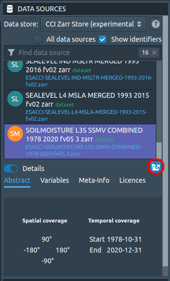
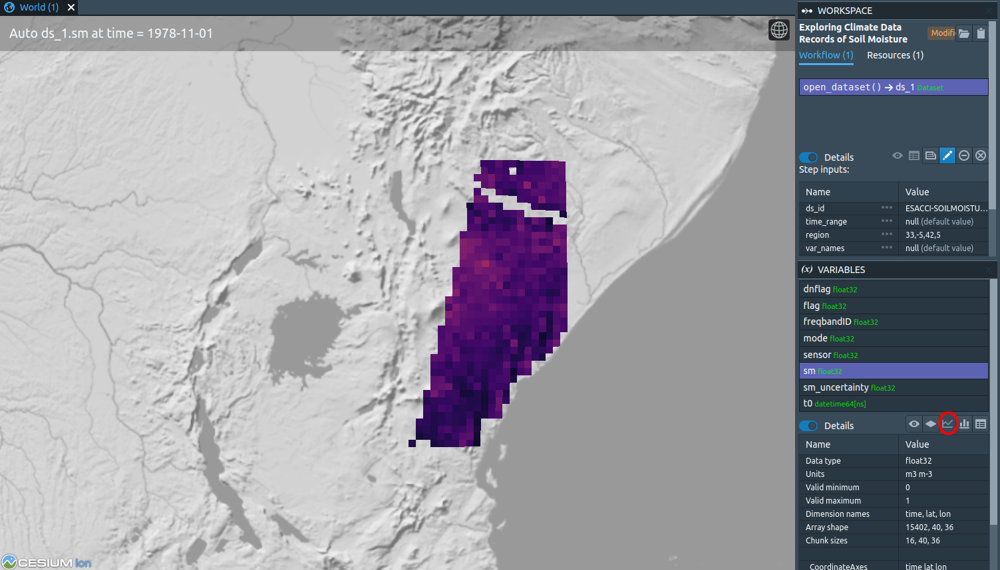
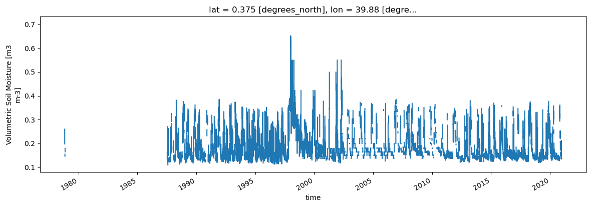
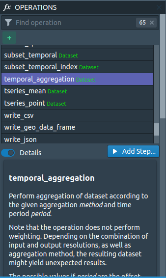
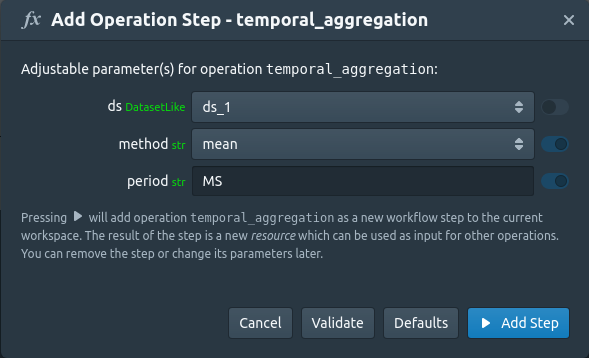
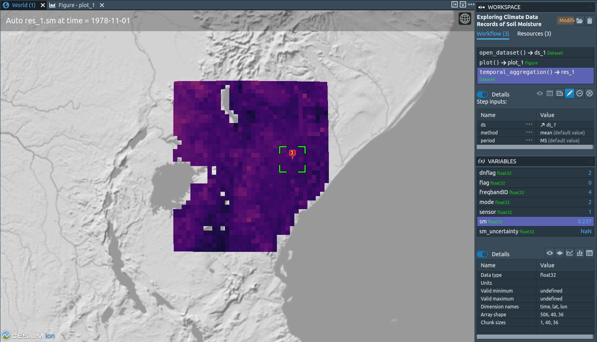
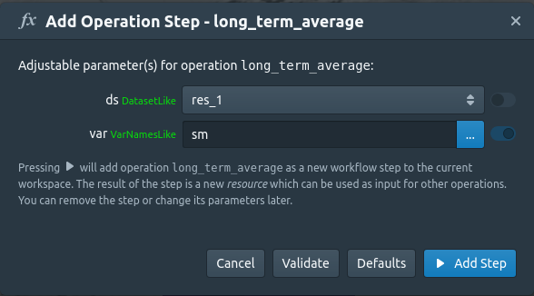
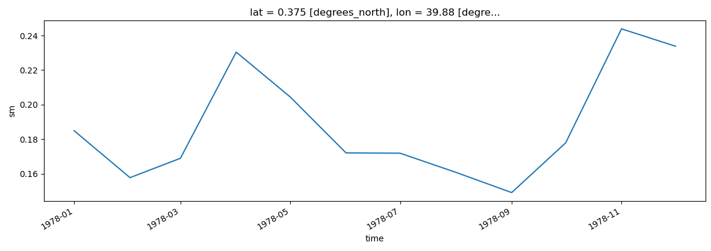

**Exercise II**

**Exploring Climate Data Records of Soil Moisture**

**In this exercise, you will access and analyse 40 years of
satellite-based soil moisture products and analyse their temporal
variabilities.**

**Exercise's objective**

The main aim of the exercise is to equip you with the skills to use CATE
to access and analyse climate records of satellite data on soil moisture
produced from the [Climate Change Initiative Project on Soil
Moisture](https://climate.esa.int/en/projects/soil-moisture/).

**Learning outcomes**

After completing this exercise, you should be able to:

1.  Access Soil Moisture Data from the Zarr Store

2.  Use CATE functionality to visualise and analyse Soil Moisture Data

**Accessing the data**

Soil Moisture Data is available via the CCI Open Data Portal Store.
However, it is also available in the CCI Zarr Store. As using data from
the Zarr Store is faster, we will use that version for this exercise.
From that Store, select *SOILMOISTURE L3S SSMV COMBINED 1978 2020 fv05 3
zarr*. After you have clicked on it, CATE will load in additional
information about the data source and display it below the data source
panel (Figure 1). From the metadata, you can see that this dataset
offers Soil Moisture values on a global scale at a spatial resolution of
0.25 degrees, and at a daily resolution from 1978 to 2020.

{width="3.03125in" height="5.0in"}

*Figure 1: The Data Sources Panel with loaded metadata about the Soil
Moisture Dataset. A red circle marks the Open Data Source button.*

Now open the data by clicking on the Open Data Source button. You can
select region, time, and variable constraints; the option to cache data
from the Zarr Store is disabled though. If you create a spatial subset,
make sure that it includes Kenya (a country that suffers from
intensified drought events and that will be at the center of our
exercise). The bounding coordinates of Kenya are longitude \[33, 42\],
latitude \[-5, 5\].

{width="6.29166447944007in"
height="3.59375in"}

*Figure 2: A spatial subset of Soil Moisture Data. A red circle marks
the button to create time series.*

After the data was loaded (Figure 2), do a right-click to place a marker
and plot the time series (Figure 3).

{width="6.29166447944007in"
height="2.1979166666666665in"}*Figure 3: Daily values of soil moisture.*

The new plot now hides the World view. To get back to the World view,
click on its tab, or arrange the views so that both the World view and
the plot are shown (Figure 4):

{width="6.531944444444444in"
height="2.2222222222222223in"}

*Figure 4: Switching between World and Plot views*

You will notice that there are gaps between measurements. You can remove
these gaps by averaging the data using a temporal aggregation operation.
Go to the *OPERATIONS* panel at the lower left and search for
*temporal_aggregation*. Read the operation description to understand how
to use it (Figure 5).

{width="2.9895833333333335in"
height="5.0in"}

*Figure 5: The Operations Panel*

Either double-click the list entry or simple-click *Add Step* to bring
up a dialog that lets you enter the operation's parameter values (Figure
6). Select the data set. The method can be any of the statistical
measures from the drop down menu, for our purposes the pre-selected
*mean* is adequate. The value *MS* in the period field stands for
months, so this is what we want. Set the method to mean, and the period
to MS, which will average to monthly data (see
[here](https://pandas.pydata.org/pandas-docs/stable/user_guide/timeseries.html#dateoffset-objects)
for a list of other supported values).

{width="6.29166447944007in"
height="3.8229166666666665in"}

*Figure 6: The Temporal Aggregation Operation Dialog.*

You will see that data gaps were filled in space and time (Figure 7).
Some spikes are observable with the largest one around the year 1998,
which corresponds to the flooding event in East Africa of this year.
Drought events can also be noticed but are harder to detect visually.

{width="6.29166447944007in"
height="3.6145833333333335in"}

*Figure 7: Temporal averaging of daily to monthly data products*

Now, let us do something with these values. To investigate the
variability, we can apply the operation *long_term_average*. Select it
from the *OPERATIONS* panel and read the documentation. Choose the
aggregated dataset as *ds* and *sm* as *var* (Figure 8).

{width="6.29166447944007in"
height="3.4895833333333335in"}

*Figure 8: The Long Term Average Operation Dialog*

A Mean (or Median, Minimum, Maximum) Monthly Climatology refers to the
Mean (or Median, Minimum, Maximum) value of the same month over the
years of observations. The 42 years of monthly data for one location
will result in a matrix 42×12. The mean monthly climatology of this
location will result in an array of 12 values, one per month.

If you create one more time series, this time, over our newly produced
monthly climatology, you can observe that the soil moisture values
experience two peaks: One from October to January and one from March to
June, with an extended "dry" period of lower soil moisture values
between June and October (Figure 9).

{width="6.53125in"
height="2.2916666666666665in"}

*Figure 9: Mean monthly climatology of soil moisture.*
