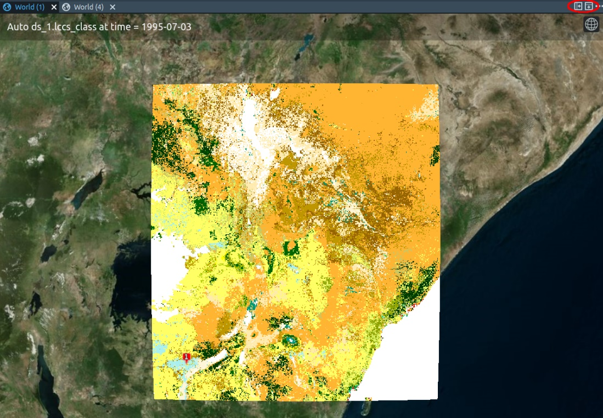
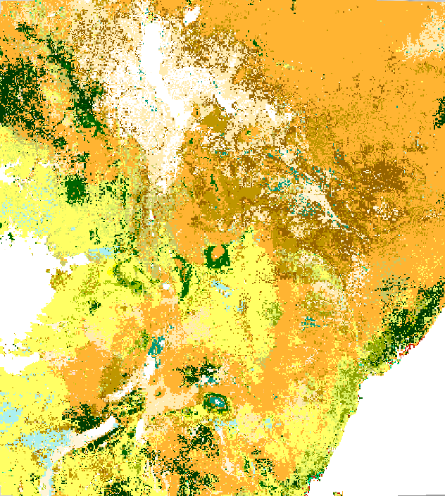
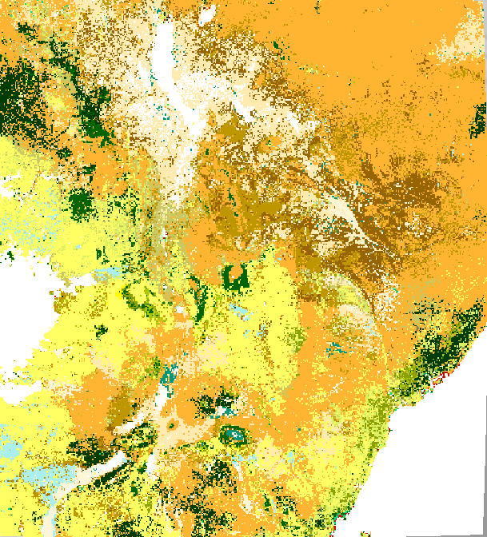
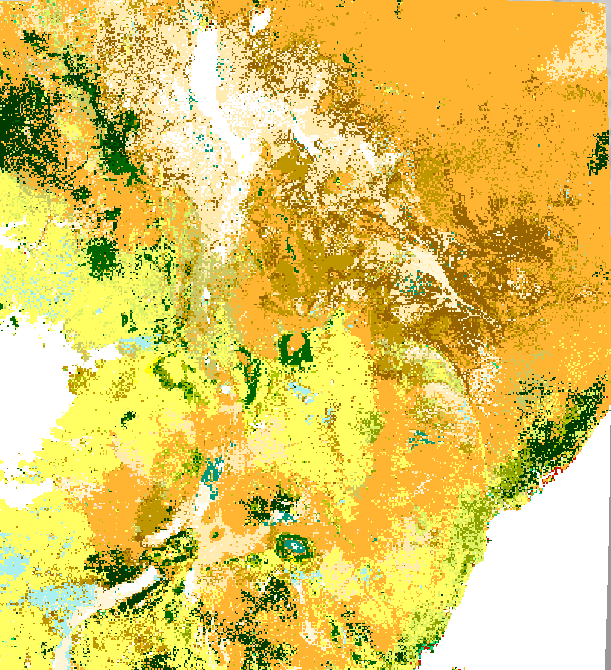

# Exercise III

**Monitoring Land Cover Change in Kenya**

*In this exercise, you will investigate the changes in the land cover
of Kenya between 1995, 2005, and 2015 using CATE.*

## Exercise's objective

The objective of this exercise is encountering Climate Change by 
changing land cover classes.
As droughts in Kenya appear to be becoming more frequent and severe over
time, the Land Cover is changing to be more arid. As a result, crop
failures and livestock deaths lead to severe food shortages in Kenya. To
mitigate the effects of climate change on food shortage in Kenya, aiding
programmes (e.g. [The International Maize and Wheat Improvement
Center](https://www.cimmyt.org/)) are heading towards introducing
drought-tolerant crops, changing thereby the land cover.

{width="6.53125in"
height="4.354166666666667in"}

*Figure 1: Drought tolerant maize route out
of poverty for community-based seed producer, Kenya, by
[CIMMYT](https://www.cimmyt.org/), licensed under [CC BY-NC-SA
2.0](https://creativecommons.org/licenses/by-nc-sa/2.0/?ref=ccsearch&atype=html).*

## Exercise's tasks

One way to start is to have a look at the [Open Data
Portal](https://climate.esa.int/en/odp/#/dashboard) where you can find
information available Land Cover products.

{width="6.53125in"
height="3.75in"}

*Figure 2: Land Cover Data in the Climate Office Website*

You can also use CATE to find Land Cover Data. There are two Land Cover
data sets available in the CCI Open Data Portal data store: One at a
temporal resolution of 13 years, the other at a 1-year resolution. The
latter is also included in the CCI Zarr Store, so for this exercise, we
are going to use that one.

*Figure 3: Land Cover Data in the CCI Zarr Store*

As the data set covers the time range we are interested in, there is no
need to select a temporal subset. If you want to apply a spatial subset,
make sure you include Kenya. The bounding box is longitude \[33, 42\],
latitude \[-5, 5\] (Figure 4).

{width="5.0in"
height="3.7395833333333335in"}

*Figure 4: Opening the Land Cover Map with a bounding box fit to Kenya.*

The Land Cover Class is given as an index. The meanings of the indexes
are explained
[here](http://maps.elie.ucl.ac.be/CCI/viewer/download/ESACCI-LC-QuickUserGuide-LC-Maps_v2-0-7.pdf).
As you can see, there is a dedicated colour bar that has been
preconfigured for Land Cover data and that is already applied in CATE.
You can change the colour bar if you activate the *STYLES* panel in the
lower right and then click the colour bar (Figure 5). However, we
recommend you stick to the dedicated Land Cover scheme.

{width="2.875in" height="5.0in"}

*Figure 5: CATE\'s STYLES panel*

At the top right, you can switch to the *LAYERS* panel by selecting the
Layers symbol. If you do so, you will see that there is a time slider
that will allow you to select different time steps (Figure 6). The time
of the selected step is always displayed at the top of the world view.

{width="3.625in"
height="4.739583333333333in"}

*Figure 6: CATE\'s LAYERS panel*

Also, you may open a second world view, which you might find convenient
to compare maps: Simply click *New World View* from CATE\'s *VIEW*
panel, located at the lower right.

{width="3.5520833333333335in"
height="2.3333333333333335in"}

*Figure 7: CATE\'s view panel*

If you have opened more than one view, you can split these horizontally
or vertically using the icons in the top right corner (Figure 8).

{width="5.0in" height="3.46875in"}

*Figure 8: A world view sharing a panel with another world view. The
icons to separate views are marked with a red circle.*

Compare the Land Cover maps of Kenya for the years 1995, 2005 and 2015
(Figures 7, 8, and 9, respectively). Pay particular attention to
cropland. Values 10, 11, and 12 (in yellow) stand for rainfed cropland;
value 20 for irrigated or post-flooding cropland.

{width="4.489583333333333in"
height="5.0in"}

*Figure 7: Kenya Land Cover Map, 1995*

{width="4.53125in" height="5.0in"}

*Figure 8: Kenya Land Cover Map, 2005*

{width="4.5625in" height="5.0in"}

*Figure 9: Kenya Land Cover Map, 2015*
